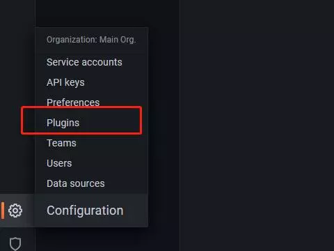
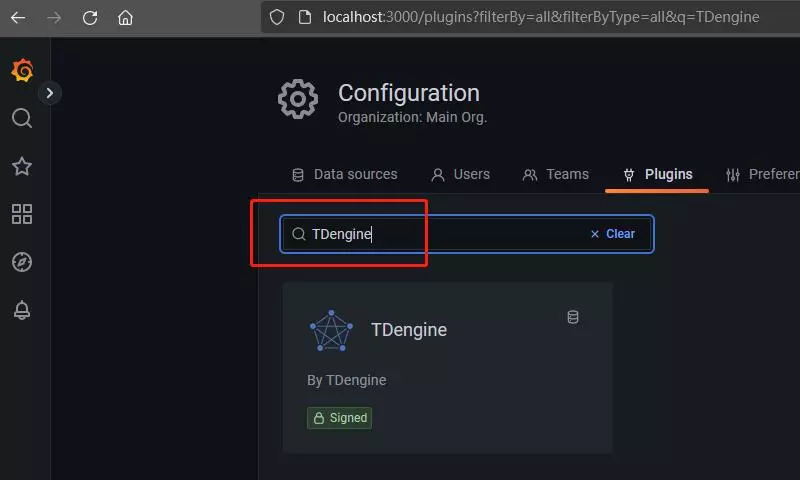

TDengine can be quickly integrated with the open-source data visualization system [Grafana](https://www.grafana.com/) to build a data monitoring and alerting system. The whole process does not require any code development. And you can visualize the contents of the data tables in TDengine on a dashboard.

You can learn more about using the TDengine plugin on [GitHub](https://github.com/taosdata/grafanaplugin/blob/master/README.md).

## Install Grafana

TDengine currently supports Grafana versions 7.5 and above. Users can go to the Grafana official website to download the installation package and execute the installation according to the current operating system. The download address is as follows: <https://grafana.com/grafana/download>.

## Install TDengine plugin

### Install with GUI

The TDengine data source plugin is already published as a signed Grafana plugin. You can easily install it from Grafana Configuration GUI. In any platform you already installed Grafana, you can open the URL http://localhost:3000 then click plugin menu from left panel.



Then key in `TDengine` to search.



### One-line installer

Please copy the following shell commands to export `TDENGINE_CLOUD_URL` and `TDENGINE_CLOUD_TOKEN` for the data source installation.

```bash
export TDENGINE_CLOUD_TOKEN="<token>"
export TDENGINE_CLOUD_URL="<url>"
```

Run below script from Linux terminal to install TDengine data source plugin.

```bash
bash -c "$(curl -fsSL https://raw.githubusercontent.com/taosdata/grafanaplugin/master/install.sh)"
```

After that completed, please restart grafana-server.

```bash
sudo systemctl restart grafana-server.service
```

## Verify plugin

Users can log in to the Grafana server (initial username/password: admin/admin) directly through the URL `http://localhost:3000`. Click `Configuration -> Data Sources` on the left side. Then click `Test` button to verify if TDengine data source works. You should see a success message if the test worked.


## Use Grafana

Please add new dashboard or import exist dashboard to illustrate the data you store in the TDengine.

And refer to the [documentation](https://docs.tdengine.com/third-party/grafana#create-dashboard) for more details.
